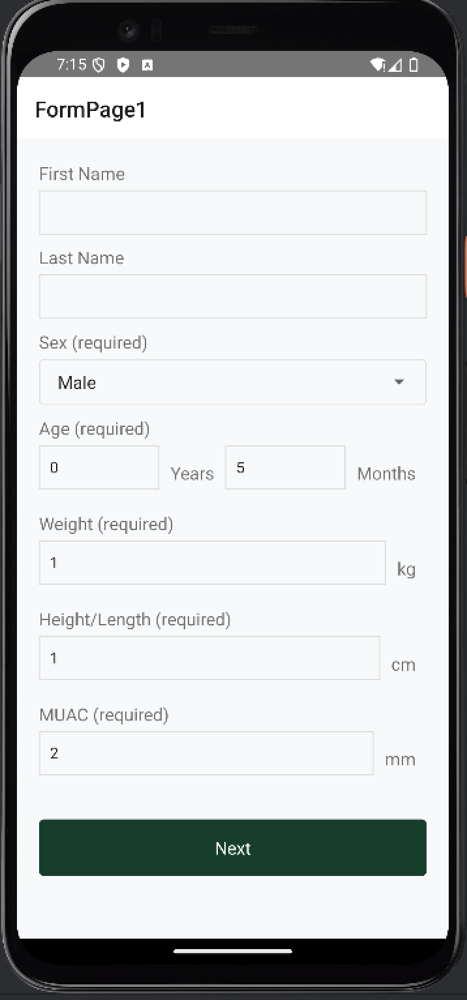
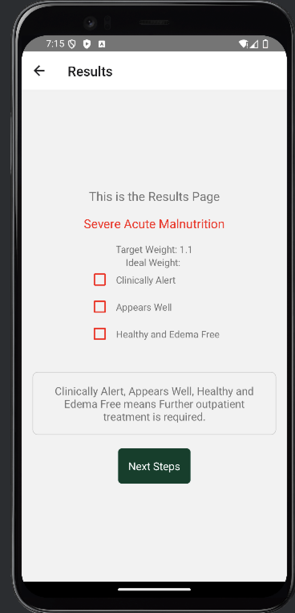
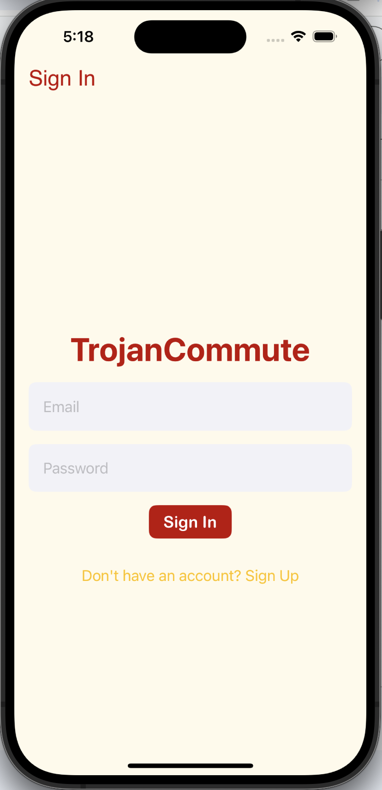
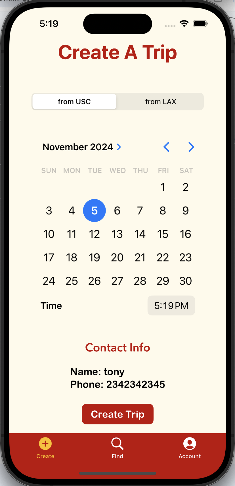
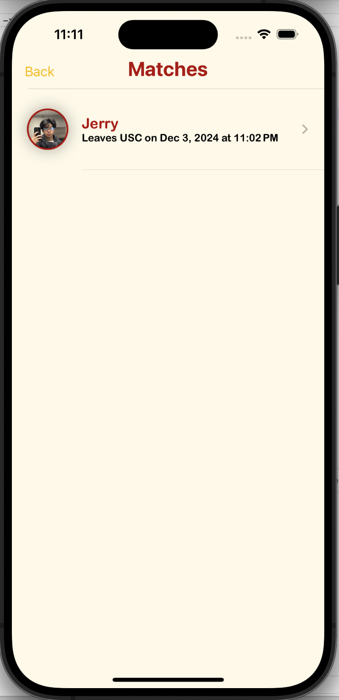

# Jerry Zhang - Project Portfolio

**Mobile & Full-Stack Developer** | Computer Science & Business Administration @ USC

*Note: Most of my professional work is in private repositories due to proprietary/university restrictions. This portfolio showcases the impact and technical scope of my projects.*

## 🚀 Featured Projects

### BraveBand - Safety App & Wearable Device
**Role:** iOS Engineer | **Timeline:** Jan 2024 - Aug 2024 | **Company:** Brave

- **Impact:** Successfully launched with 400+ bracelets deployed across USC and LMU campuses
- **Tech Stack:** SwiftUI, UIKit, Firebase, JavaScript, Node.js
- **What I Built:** Complete iOS app allowing users to send location-based emergency alerts via wearable bracelet
- **Key Achievement:** Led Kickstarter campaign that secured university adoption deals

https://www.braveband.tech/shop-the-bracelet

*Code is proprietary to Brave*

### Malnutrition Detection App
**Role:** Mobile Application Developer | **Timeline:** May 2024 - Present | **Organization:** Lalmba Association

 

- **Impact:** Currently assisting in malnutrition detection for 1,000+ Ethiopian children
- **Tech Stack:** React Native, Android Studio
- **What I Built:** Android app with robust data analysis algorithms for health metric processing
- **Key Features:** Multi-step assessment forms, real-time malnutrition classification, care recommendations, immunization tracking
- **Key Achievement:** Boosted volunteer efficiency by 300% compared to traditional detection methods
- 
https://www.lalmba.org/

*Code is proprietary to Lalmba Association*

### Trojan Commute - USC Ride Sharing App
**Role:** Solo Developer | **Timeline:** Mar 2024 - Apr 2024 | **Personal Project**

  

- **Impact:** Designed to reduce LAX Uber costs by 50%+ for USC students
- **Tech Stack:** Swift, Firebase, MapKit, Core Location, Twilio API
- **What I Built:** 
  - Real-time ride matching system optimized for airport trips
  - Firebase authentication and real-time database
  - SMS integration via Twilio API
  - Seamless integration with iOS Contacts, Photos, and Calendar
- **Key Features:** USC/LAX route optimization, calendar integration for trip planning, real-time matching algorithm

*Code available upon request for interviews*

### SpotiFeels - Emotion-Based Music Recommendation
**Role:** Full-Stack Developer | **Timeline:** Sep 2023 - Nov 2023 | **Team Project**

- **Impact:** 15% increase in user retention, 20% boost in user satisfaction
- **Tech Stack:** JavaScript, HTML/CSS, Express.js, Hume AI, Spotify API
- **What I Built:**
  - Real-time facial emotion recognition via webcam
  - Integration with Spotify API for personalized playlists
  - Full-stack web application with responsive design

*University project - code available upon request*

## 🛠️ Technical Skills

**Languages:** JavaScript, Python, Swift, Java, C++, HTML/CSS
**Mobile:** React Native, SwiftUI, UIKit, Android Studio
**Backend:** Node.js, Firebase, Express.js, MongoDB
**APIs:** Spotify API, Google Maps API, Twilio, Hume AI
**Tools:** Git, RESTful APIs, CloudKit, Core Location

## 📊 Professional Experience

- **Mobile App Developer** at Lalmba Association (Remote)
- **iOS Engineer** at Brave (Los Angeles)
- **Software Engineering Specialist** at USC Annenberg Media
- **Web Developer** at ACME Window Hardware (Toronto)

## 🎯 What I'm Looking For

Currently seeking **Summer 2025 internship opportunities** in:
- Mobile Development (iOS/Android)
- Full-Stack Development
- Startups focused on social impact or consumer apps

## 📫 Connect With Me

- **Email:** jjzhang@usc.edu
- **LinkedIn:** [linkedin.com/in/jerry-jz](https://www.linkedin.com/in/jerry-jz/)
- **Location:** Los Angeles, CA

---

*For code samples, live demos, or detailed technical discussions about any of these projects, feel free to reach out!*
